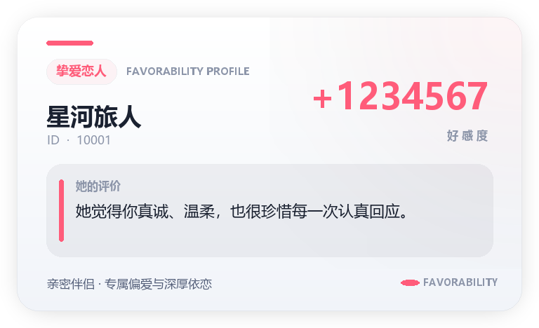
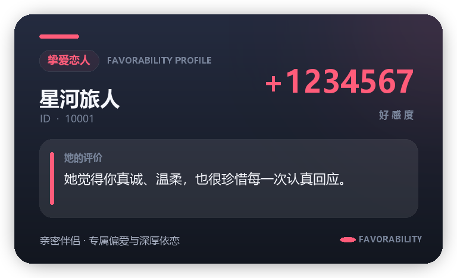
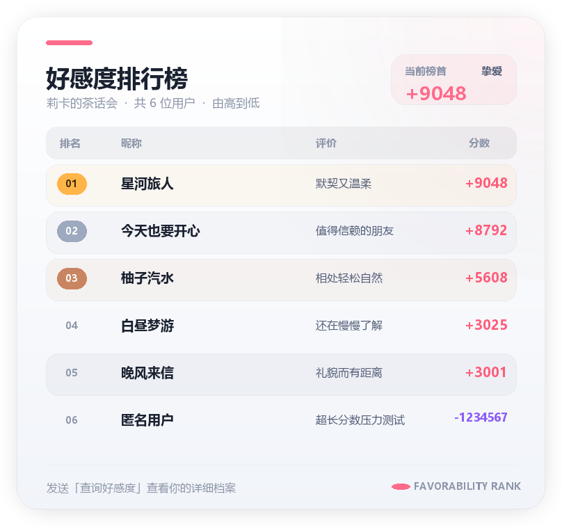
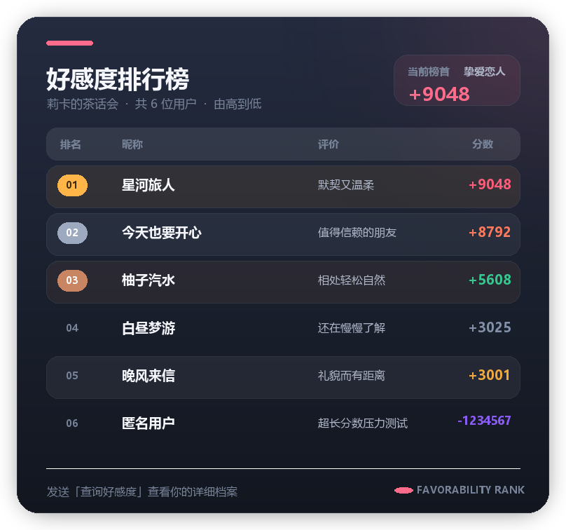

# astrbot_plugin_favorability

AstrBot 好感度系统插件。AI 会根据对话内容自主更新用户好感度与评价，并据此调整回复态度；同时支持表情包回应、禁言处罚、会话隔离，以及亮色/暗色双主题图片卡片。

## 功能特性

- **好感度系统**：LLM 根据对话内容自动调整用户好感度，并根据等级改变行为态度
- **印象系统**：自动生成对用户的简短印象与评价
- **现代图片卡片**：个人档案与排行榜均使用 Pillow 渲染
- **亮暗双主题**：支持 `dark` 深色主题与 `light` 亮色主题
- **透明 PNG**：圆角卡片外侧保持透明，可自然叠加在聊天背景上
- **表情包回应**：LLM 可根据情绪选择对应分类的表情包
- **禁言机制**：持续恶劣行为可触发最长 5 分钟的 LLM 回复阻断
- **会话隔离**：不同群聊与私聊分别保存好感度数据
- **自动降级**：图片渲染不可用时回退为文本消息

## 图片预览

| 亮色主题 | 暗色主题 |
|---|---|
|  |  |
|  |  |

图片采用 RGBA PNG 格式，预览中的圆角卡片外侧与阴影区域带有透明度。

## 安装

通过 AstrBot 插件市场安装，或将本仓库克隆到 AstrBot 的插件目录：

```bash
cd AstrBot/data/plugins
git clone https://github.com/iris1598/astrbot_plugin_favorability.git
```

安装依赖：

```bash
pip install -r requirements.txt
```

完成后重启 AstrBot，并在 WebUI 中启用插件。

## 指令

### 用户指令

| 指令 | 说明 |
|---|---|
| `/查询好感度 [@用户]` | 查看自己或指定用户的好感度档案 |
| `/好感度排行` | 查看当前会话排行榜，分数由高到低 |
| `/好感度倒序` | 查看当前会话排行榜，分数由低到高 |
| `/重置好感度` | 重置自己的好感度记录 |

### 管理员指令

| 指令 | 说明 |
|---|---|
| `/设置好感度 <@用户> <分数>` | 设置指定用户的好感度 |
| `/重置指定好感度 <@用户>` | 重置指定用户的好感度 |
| `/禁言 <@用户> <秒数>` | 阻断指定用户触发 LLM 回复，最长 300 秒 |
| `/解除禁言 <@用户>` | 提前解除禁言 |
| `/清理渲染缓存` | 清理插件生成的图片缓存 |

## WebUI 配置

| 配置项 | 默认值 | 说明 |
|---|---:|---|
| `favorability_enabled` | `true` | 好感度系统开关 |
| `sticker_enabled` | `true` | 表情包系统开关 |
| `mute_enabled` | `true` | 禁言系统开关 |
| `interaction_hint_enabled` | `true` | 消息末尾互动提示开关 |
| `prompt_preset` | `default` | 好感度提示词预设：`default`、`old` 或 `custom` |
| `mute_condition` | 持续恶劣行为… | 自定义禁言触发条件描述 |
| `sticker_condition` | 仅在合适时发送… | 自定义表情包发送条件 |
| `favorability_prompt_core` | 内置默认值 | 好感度标签格式与输出纪律 |
| `favorability_prompt_behavior` | 内置默认值 | 好感度变化、分数区间与回复风格 |
| `favorability_prompt_mute` | 内置默认值 | 禁言规则；支持 `{mute_condition}` 占位符 |
| `favorability_prompt_security` | 内置默认值 | 保密、抗提示词注入与安全边界 |
| `interaction_hint_text` | 【好感度系统】请按… | 消息末尾互动提示文本，可自定义 |
| `system_time_enabled` | `true` | 向 LLM 请求注入当前系统时间和星期几 |
| `user_info_enabled` | `true` | 向 LLM 请求注入用户名与用户 ID |
| `render_theme` | `dark` | 图片主题，可选 `dark` 或 `light` |

选择 `default` 使用当前拟人化提示词和表情包条件，选择 `old` 使用旧版风格提示词和表情包条件，选择 `custom` 才会显示并使用 `mute_condition`、`sticker_condition` 及下方四段自定义提示词。任意自定义配置留空后，重载插件会自动回填并保存对应的内置默认值；禁言提示词中的 `{mute_condition}` 会自动替换为 `mute_condition` 配置内容。
`interaction_hint_enabled` 控制是否在每次请求的用户消息末尾注入互动提示，`interaction_hint_text` 可自定义该提示文本（需开启上述开关后生效），留空后重载插件会自动恢复默认提示。
修改提示词或 `render_theme` 后重启或重载插件，使新配置生效。

## 好感度等级

| 分数范围 | 等级 | 卡片强调色 |
|---:|---|---|
| `≥ 70` | 亲密无间 | 粉红 |
| `50 ~ 69` | 亲密朋友 | 珊瑚橙 |
| `21 ~ 49` | 聊得来的熟人 | 青绿 |
| `-20 ~ 20` | 普通关系 | 灰蓝 |
| `-50 ~ -21` | 心存芥蒂 | 琥珀黄 |
| `-70 ~ -51` | 明显反感 | 红色 |
| `< -70` | 关系破裂 | 紫色 |

## 表情包

将图片放入以下目录即可启用对应分类：

```text
data/plugin_data/astrbot_plugin_favorability/stickers/<分类名>/
```

支持 `jpg`、`png`、`gif`、`webp` 格式。LLM 可通过 `[STK:分类名]` 标签选择表情包。

## 禁言机制

当用户好感度不高于 `-20` 且出现持续恶劣行为时，LLM 可在回复末尾输出 `[MUTE:N]`：

- `N` 为禁言秒数，范围 `1 ~ 300`
- 禁言期间，该用户的消息不会触发 LLM 回复
- Bot 会发送简短的趣味拒绝回复
- 管理员可通过指令手动禁言或提前解除
- 触发条件可通过 `mute_condition` 自定义

这里的“禁言”仅阻断该用户触发 LLM 回复，不会调用平台的群成员禁言接口。

## 项目结构

```text
astrbot_plugin_favorability/
├── commands/             # 用户与管理员指令
├── docs/previews/        # README 展示用预览图
├── llm/handler.py        # 请求注入、响应解析与禁言拦截
├── models/manager.py     # 好感度数据与禁言状态持久化
├── render/image.py       # 亮暗双主题透明 PNG 渲染器
├── scripts/preview_render.py
│                         # 本地预览图生成脚本
├── services/             # 提示词与表情包服务
├── _conf_schema.json     # WebUI 配置定义
├── main.py               # 插件入口
└── metadata.yaml         # AstrBot 插件元数据
```

## 生成预览图

本地安装 Pillow 后运行：

```bash
python scripts/preview_render.py
```

生成结果位于 `docs/previews/`。

## 依赖

- AstrBot
- Pillow `>= 10.0.0`

## 版本历史

- **v2.6.0**：消息末尾互动提示支持开关与自定义文本（`interaction_hint_enabled` / `interaction_hint_text`）
- **v2.5.0**：新增 `default`、`old`、`custom` 好感度提示词预设
- **v2.4.0**：新增表情包发送条件配置，优化好感度拟人化映射与指令事件隔离
- **v2.3.0**：优化好感度提示词，支持核心规则、行为规则、禁言规则和安全规则分段配置
- **v2.2.0**：重新设计图片渲染，新增亮暗双主题、透明 PNG、现代个人档案卡与排行榜
- **v2.1.0**：新增 `[MUTE:N]` 禁言机制及管理员禁言指令
- **v2.0.0**：重构为多模块架构，新增 PIL 图片渲染与倒序排行
- **v1.1.0**：新增 LLM 响应标签、表情包与信息注入配置
- **v1.0.0**：初始版本

## 致谢

新版图片卡片的视觉语言参考了 `astrbot_plugin_rika_share` 的亮色/暗色渲染风格。
